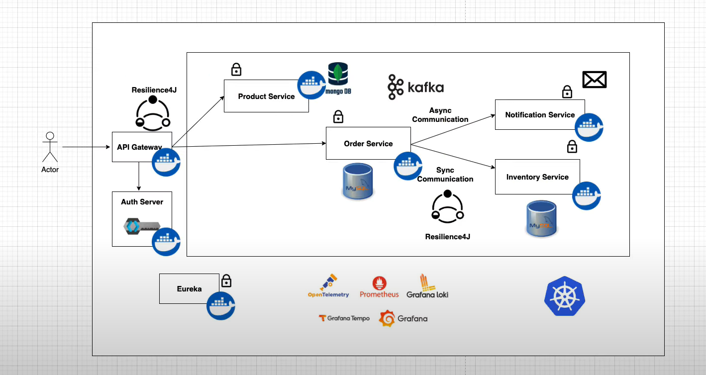

# E-Commerce Microservices Platform

A scalable, microservices-based e-commerce platform built with **Spring Boot 3**, **Spring Cloud**, **Docker**, **Kafka**, **MongoDB**, and **MySQL**. This platform demonstrates a modern approach to building resilient, distributed systems with centralized routing, authentication, and fault tolerance.

---

## **Features**

- **Microservices Architecture:**  
  - Product Service  
  - Order Service  
  - Inventory Service  
  - Notification Service  

- **Centralized API Gateway:**  
  - Handles routing and management for all microservices.  
  - Secures external access with **Keycloak** authentication and authorization.

- **Communication:**  
  - REST APIs for synchronous communication.  
  - **Kafka** for asynchronous, event-driven messaging.

- **Resilience & Fault Tolerance:**  
  - Implemented **Resilience4J** to ensure high availability and 99.9% uptime.

- **Databases:**  
  - **MySQL** for relational data (Orders, Inventory).  
  - **MongoDB** for document-based storage (Products, Notifications).

---

## **Architecture Overview**

- The API Gateway manages all external requests, centralizes authentication via Keycloak, and routes requests to individual microservices.  
- Services communicate via REST for synchronous operations and Kafka for events like order updates and notifications.  
- Each service is independently deployable and containerized using Docker.

---

## Tech Stack

- **Backend:** Spring Boot 3, Spring Cloud for building scalable and maintainable microservices.  
- **API Gateway:** Spring Cloud Gateway for centralized routing, load balancing, and request management.  
- **Messaging:** Apache Kafka for asynchronous, event-driven communication between services.  
- **Databases:** MySQL for relational transactional data, MongoDB for document-based storage.  
- **Authentication & Authorization:** Keycloak for secure and centralized user management.  
- **Fault Tolerance:** Resilience4J for circuit breaking, retries, and fallback mechanisms to maintain high availability.  
- **Build & Dependency Management:** Maven for building and managing project dependencies.  
- **Version Control:** Git and GitHub for source code management and collaboration.  

